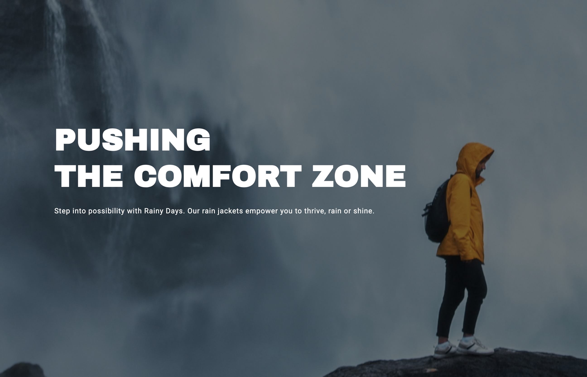

# Cross-Course Project (Design, HTML & CSS)

## Description

### Goal:

To put into practice everything I’ve learned about HTML and CSS over the course by bringing my design alive.

### Brief:

- The HTML should be semantic, neatly formatted and valid.
- The CSS should follow the DRY principle and be easy to read.
- The website should be responsive and look good at every screen size with no horizontal scrollbars.
- Each page should have a unique 'meta name="description"', 'title', 'h1'.
- The site should be WCAG compliant, and accessibility should be taken into account.

## Built With

- HTML
- CSS
